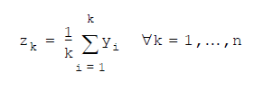

# Health Check Pattern Example

This example provides a basic implementation of the Health Check API pattern. The Health Check API Pattern allows an 
external monitoring tool to continuously track the availability of an API and its dependent systems. This example 
implementation demonstrates:

  - How to define a new resource `/health` the allows external consumers to check the status of an API and its dependent system.
  - How to capture the average response time of the dependent system utilized by the API. 
  - How to capture the average payload size constructed by the API. 

### What is the Health Check API Pattern?
In many instances, APIs are built to provide a façade layer for the underlying system. When an API fails, it is rarely 
a failure of the API itself but the underlying system. Thus, it is important to periodically check the health of the 
of the core system to ensure that it is capable of supporting incoming requests. The Health Check API resource 
can perform a variety of system checks to measure availability and performance.

### How is the Health Check API Pattern implemented?

#### System Response Time
To measure the response time of the dependent system, timestamps are captured before and after the call to the system and
subtracted to retrieve duration in milliseconds:

```
%dw 2.0
output application/java
---
(vars.afterSystemAccess - vars.beforeSystemAccess) as Number {unit: "milliseconds"}
``` 

#### System Payload Size
To measure the payload size provided by the dependent system, write the contents of the resulting payload as formatted JSON and return the size of the contents.
The return value can then be divided by unit desired (e.g. for KB, divide the resturn value by 1024 since 1024 bytes = 1 KB). 
```
%dw 2.0
output application/java
var content= write(payload, 'application/json', {indent:true})
var size= sizeOf(content) / 1024
---
size as String {format: '#.00'}
```

#### Running Averages
A running (a.k.a. rolling or moving) average is an average that continually changes as more data points are collected. A running average is calculated by adding the current 
value to the sum of the preceding values and dividing by the current count of values.


#### Average System Response Times
 
The _average system response time_ is calculated by dividing the collection of all previous system response time values and the dividing by the total number of requests. 
 
```
%dw 2.0
output application/java
var numberOfRequests = vars.numOfReq as Number
---
if (numberOfRequests > 0)
	round((vars.srtRunningTotal as Number)/numberOfRequests)
else 
	0
```

#### Average System Payload Size
The _average system payload size_ is calculated by dividing the collection of all previous system payload size values and the dividing by the total number of requests. 

 ```
 %dw 2.0
output application/java
var numberOfRequests = vars.numOfReq as Number
---
if (numberOfRequests > 0) 
	((vars.psRunningTotal as Number)/numberOfRequests)
else 
	0
```

### How can the Health Check API Pattern be utilized?
An external monitoring tool (like Anypoint’s API Functional Monitoring) can periodically invoke the health check operation 
to check the status of the API and its dependent systems. If any errors are uncovered by the operation’s response, the 
monitoring tool can be configured to notify the operations team.

### What about other metrics?
This example can be cloned and updated to calculate any dependent system metric desired, go ahead, give it a try!
